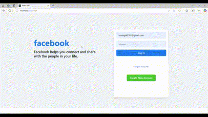
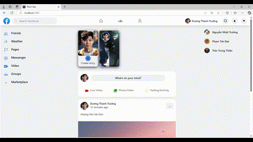
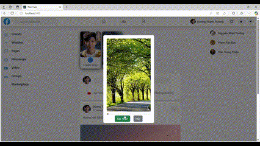
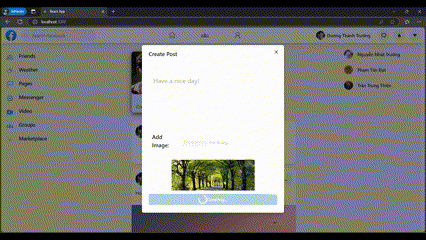
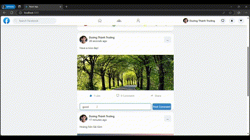
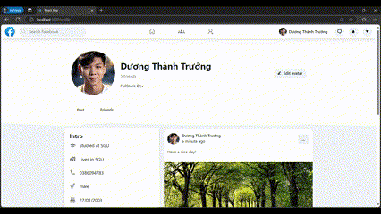
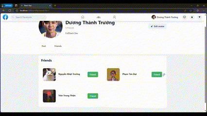
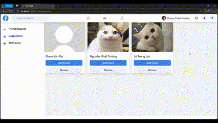
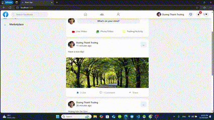
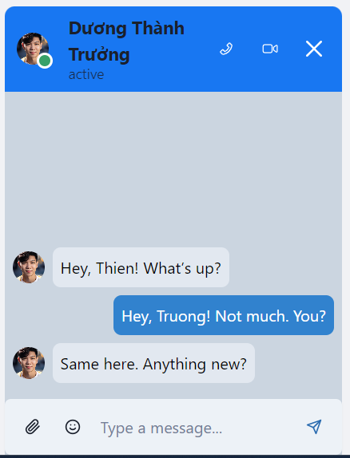

# Facebook Frontend
## Link to Back-end: [Click here](https://github.com/BT2701/facebook-microservice-be)
## Introduction

This project is a frontend application for Facebook, built using Create React App.


## Table of Contents

- [Facebook Frontend](#facebook-frontend)
  - [Introduction](#introduction)
  - [Table of Contents](#table-of-contents)
  - [Project Members](#project-members)
  - [Features](#features)
  - [Technologies](#technologies)
    - [Frontend](#frontend)
    - [State Management](#state-management)
    - [Networking](#networking)
    - [Others](#others)
  - [Installation](#installation)
    - [Prerequisites](#prerequisites)
    - [Install React](#install-react)
    - [Common issues](#common-issues)
  - [Usage](#usage)
    - [Clone the repository](#clone-the-repository)
    - [`npm install`](#npm-install)
    - [`npm start`](#npm-start)
    - [`npm test`](#npm-test)
    - [`npm run build`](#npm-run-build)
    - [`npm run eject`](#npm-run-eject)
  - [Contributing](#contributing)
  - [License](#license)

## Project Members
- **3121410470**: [Tran Trung Thien](https://github.com/thientranreal)
- **3121410546**: [Duong Thanh Truong](https://github.com/BT2701)
- **3121410128**: [Pham Van Du](https://github.com/vandu178)
- **3121410149**: [Pham Tan Dat](https://github.com/phamtandat655)
- **3121410542**: [Nguyen Nhat Truong](https://github.com/nhattruong16062003)
- **3121410309**: [Le Trong Luc](https://github.com/luccute)

## Features
- Login, Registration, Forgot Password, User Profile
- Search Information Page
- Messaging Interface, Calling
- Notifications
- Posts/Stories, Post Interactions
- Friends Connection Page
  
<table width:100>
        <tr>
            <td></td>
            <td></td>
        </tr>
        <tr>
            <td></td>
            <td></td>
        </tr>
        <tr>
            <td></td>
            <td></td>
        </tr>
        <tr>
            <td></td>
            <td></td>        
        </tr>
        <tr>
            <td></td>
            <td></td>
        </tr>
        <tr>
            <td></td>
            <td></td>
        </tr>
        
</table>

## Technologies

### Frontend
- React.jsx
- React-Bootstrap
- Material-UI
- CSS

### State Management
- Context API for global state management
- Hooks for local state management

### Networking
- Axios
- RESTful API

### Others
- Other graphic libraries


## Installation

To install the project, follow these steps:

### Prerequisites

Make sure you have Node.js and npm installed. You can download them from [Node.js official website](https://nodejs.org/).


### Install React

If you haven't installed React globally, you can follow the instructions in the [React documentation](https://reactjs.org/docs/getting-started.html).

### Common issues

- **Permission errors**: If you encounter permission errors during installation, try running the commands with `sudo` (Linux/macOS) or as an administrator (Windows).
- **Network issues**: If you face network issues, ensure you have a stable internet connection or try using a different network.

Once the installation is complete, you can proceed to the [Usage](#usage) section to start the application.

## Usage

In the project directory, you can run:

### Clone the repository

First, clone the repository to your local machine using the following command:

```bash
git clone https://github.com/BT2701/facebook-frontend.git
cd facebook-frontend
```

### `npm install`

Install the project dependencies by running:

```bash
npm install
```

### `npm start`

Runs the app in development mode.\
Open [http://localhost:3000](http://localhost:3000) to view it in your browser.

The page will reload when you make changes.\
You may also see any lint errors in the console.

### `npm test`

Launches the test runner in the interactive watch mode.\
See the section about [running tests](https://facebook.github.io/create-react-app/docs/running-tests) for more information.

### `npm run build`

Builds the app for production to the `build` folder.\
It correctly bundles React in production mode and optimizes the build for the best performance.

The build is minified and the filenames include the hashes.\
Your app is ready to be deployed!

### `npm run eject`

**Note: this is a one-way operation. Once you `eject`, you can't go back!**

If you aren't satisfied with the build tool and configuration choices, you can `eject` at any time. This command will remove the single build dependency from your project.

## Contributing

Contributions are welcome! Please fork the repository and create a pull request.

## License

This project is licensed under [Apache License Version 2.0](LICENSE).
